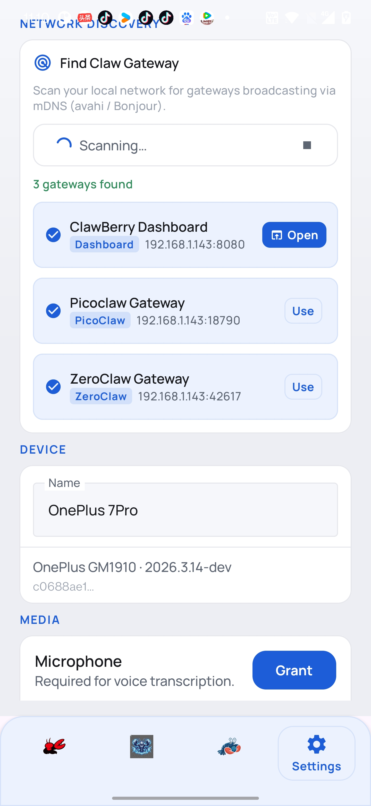
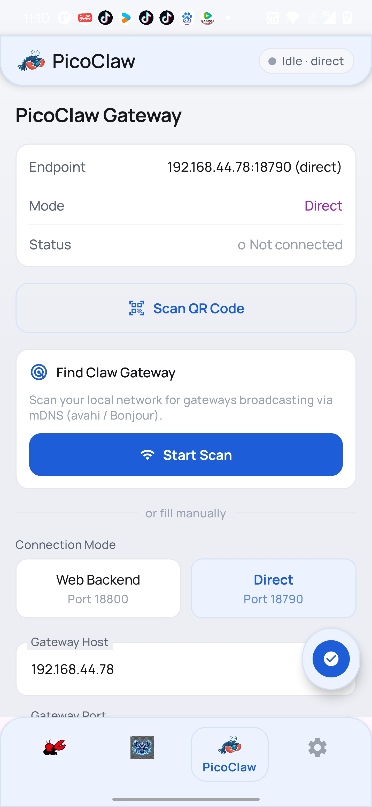
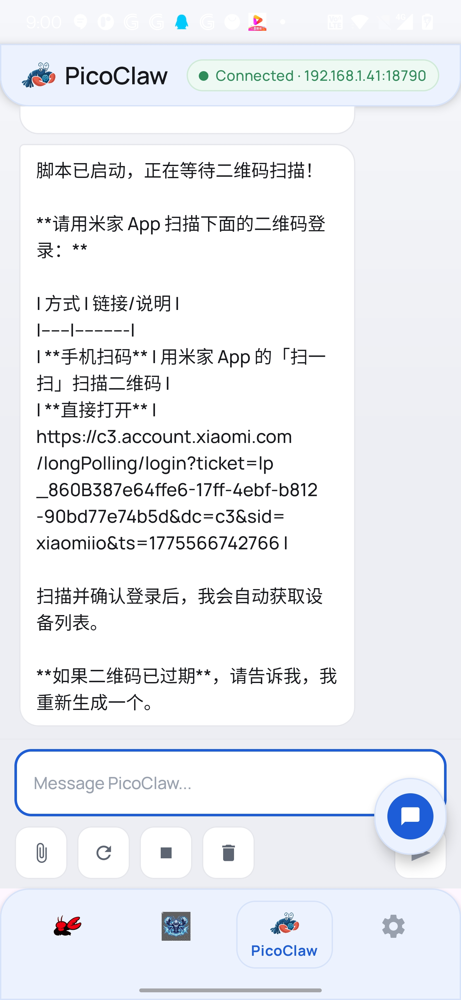
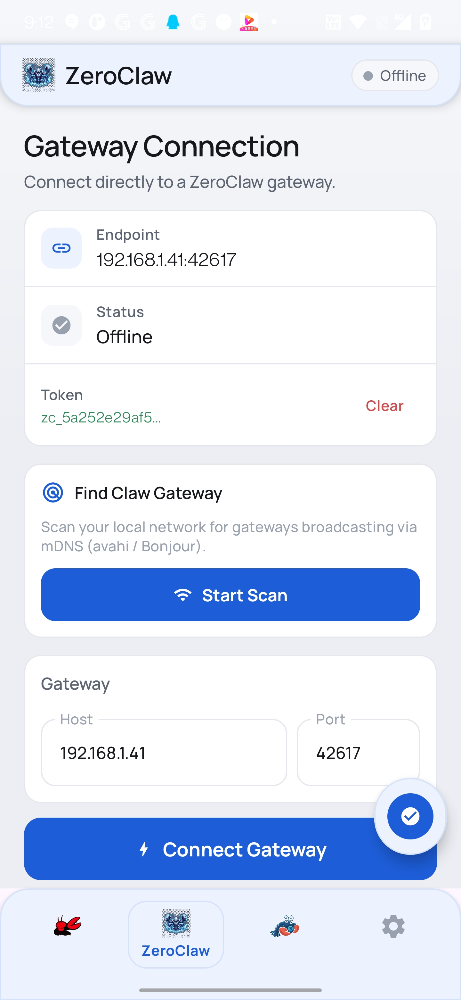
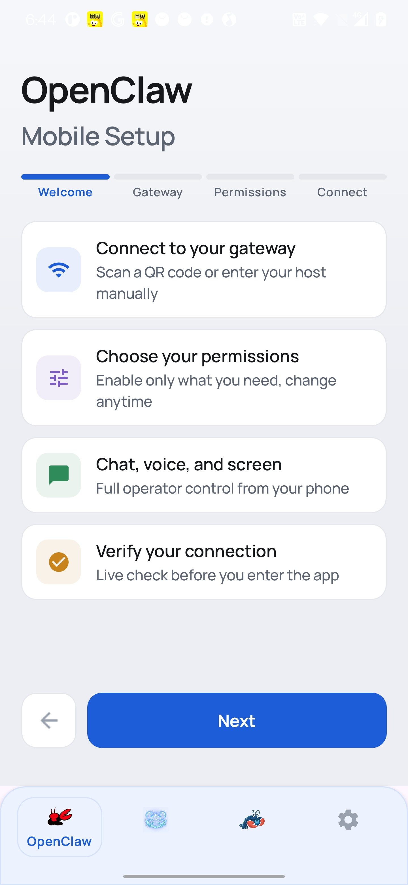

# ClawBerry

An Android companion app for [OpenClaw](https://github.com/openclaw/openclaw) with extended support for **ZeroClaw** and **PicoClaw** AI gateways.

> **Based on** [openclaw/openclaw](https://github.com/openclaw/openclaw/tree/main/apps/android) — MIT License, © 2025 Peter Steinberger.
> This fork adds ZeroClaw/PicoClaw support, custom UI, QR onboarding, voice input, and other enhancements.

---

## Screenshots

<table>
  <tr>
    <td align="center"></td>
    <td align="center"></td>
    <td align="center"></td>
    <td align="center"></td>
    <td align="center"></td>
  </tr>
</table>

---

## Main Features

### 🐻 ZeroClaw Chat
Connect to a **ZeroClaw** AI gateway and chat with streaming responses. Supports:
- Direct connection (host + port + token) or **via ClawProxy** (port 18780, no token needed)
- Streaming chunks with tool-call and tool-result display
- Session management — restore or start a new session on reconnect
- ASR voice input with language selection and press-to-talk

### 🐾 PicoClaw Chat
Connect to a **PicoClaw** AI gateway in three modes:
- **Web Backend** — fetches a session token automatically over HTTP
- **Direct** — user supplies a token for direct WebSocket access
- **Via Proxy** — connects through ClawProxy (port 18780, no token or pairing needed)
- Streaming message updates, typing indicator, ASR voice input

### 🤖 OpenClaw
Original OpenClaw gateway integration — pair your device via setup code or QR scan, then access the full command set (SMS, calls, camera, notifications, screen canvas, and more).

### 🎤 Voice Input (ASR)
All three chat tabs include press-to-talk voice input powered by the on-device Speech Recogniser:
- Language selector persisted per tab
- Recognised text appended to or replaces the current input draft

### 📱 Screen / Canvas
A2UI canvas surface displayed in the **Screen** tab — supports interactive canvas commands from the gateway.

### 🔗 ClawProxy Support
All gateway tabs support transparent **[ClawProxy](https://github.com/zphilip/ClawBoard/tree/main/clawproxy)** mode (part of the [ClawBoard](https://github.com/zphilip/ClawBoard) project):
- Proxy port default: **18780**
- No token or pairing code required — ClawProxy handles authentication on its side
- Wire format is identical to a direct gateway connection
- ClawProxy v4 includes a SQLite-backed offline message queue for resilient delivery

### 🔒 Security
- Biometric lock support
- Encrypted token persistence
- Token stripped from WebSocket headers when connecting via proxy

---

## Project Ecosystem

| Project | Role | Language |
|---|---|---|
| [ClawBerry](https://github.com/zphilip/ClawBerry) *(this repo)* | Android companion app | Kotlin / Jetpack Compose |
| [ClawBoard](https://github.com/zphilip/ClawBoard) | Web dashboard for ZeroClaw `config.toml` + **ClawProxy** transport | Python / Go |
| [ZeroClaw](https://github.com/zeroclaw-labs/zeroclaw) | AI agent runtime (ZeroClaw gateway) | TypeScript |
| [OpenClaw](https://github.com/openclaw/openclaw) | Original gateway framework (upstream) | TypeScript |

### ClawBoard

[ClawBoard](https://github.com/zphilip/ClawBoard) is a mobile-friendly [NiceGUI](https://nicegui.io/) web dashboard for editing ZeroClaw's `config.toml` at runtime. It also ships **ClawProxy** — a Go-based transparent WebSocket proxy that sits in front of ZeroClaw/PicoClaw gateways:

- 10-tab config UI covering providers, channels, memory, security, agent, scheduler and more
- Supports all 18 channel types (Telegram, Discord, Slack, Signal, WhatsApp, DingTalk, Lark, Email, etc.)
- **ClawProxy** (`clawproxy/`) — transparent reverse proxy at port **18780**, SQLite-backed offline queue (v4), no client-side auth needed
- Save & Restart button writes `config.toml` and restarts `zeroclaw.service` via `systemctl`
- Fully mobile-friendly (Quasar/Material UI)

```bash
# Run ClawBoard dashboard
pip install nicegui toml
cd ClawBoard
python3 dashboard.py
# Open http://<host>:8080
```

---

## OpenClaw Android App (upstream notes)

Status: **extremely alpha**. The app is actively being rebuilt from the ground up.

### Rebuild Checklist

- [x] New 4-step onboarding flow
- [x] Connect tab with `Setup Code` + `Manual` modes
- [x] Encrypted persistence for gateway setup/auth state
- [x] Chat UI restyled
- [x] Settings UI restyled and de-duplicated (gateway controls moved to Connect)
- [x] QR code scanning in onboarding
- [x] Performance improvements
- [x] Streaming support in chat UI
- [x] Request camera/location and other permissions in onboarding/settings flow
- [x] Push notifications for gateway/chat status updates
- [x] Security hardening (biometric lock, token handling, safer defaults)
- [x] Voice tab full functionality
- [x] Screen tab full functionality
- [ ] Full end-to-end QA and release hardening

## Open in Android Studio

- Open the folder `apps/android`.


## Connect / Pair

1) Start the gateway (on your main machine):

```bash
pnpm openclaw gateway --port 18789 --verbose
```

2) In the Android app:

- Open the **Connect** tab.
- Use **Setup Code** or **Manual** mode to connect.

3) Approve pairing (on the gateway machine):

```bash
openclaw devices list
openclaw devices approve <requestId>
```

More details: `docs/platforms/android.md`.

## Permissions

- Discovery:
  - Android 13+ (`API 33+`): `NEARBY_WIFI_DEVICES`
  - Android 12 and below: `ACCESS_FINE_LOCATION` (required for NSD scanning)
- Foreground service notification (Android 13+): `POST_NOTIFICATIONS`
- Camera:
  - `CAMERA` for `camera.snap` and `camera.clip`
  - `RECORD_AUDIO` for `camera.clip` when `includeAudio=true`

## Google Play Restricted Permissions

As of March 19, 2026, these manifest permissions are the main Google Play policy risk for this app:

- `READ_SMS`
- `SEND_SMS`
- `READ_CALL_LOG`

Why these matter:

- Google Play treats SMS and Call Log access as highly restricted. In most cases, Play only allows them for the default SMS app, default Phone app, default Assistant, or a narrow policy exception.
- Review usually involves a `Permissions Declaration Form`, policy justification, and demo video evidence in Play Console.
- If we want a Play-safe build, these should be the first permissions removed behind a dedicated product flavor / variant.

Current OpenClaw Android implication:

- APK / sideload build can keep SMS and Call Log features.
- Google Play build should exclude SMS send/search and Call Log search unless the product is intentionally positioned and approved as a default-handler exception case.

Policy links:

- [Google Play SMS and Call Log policy](https://support.google.com/googleplay/android-developer/answer/10208820?hl=en)
- [Google Play sensitive permissions policy hub](https://support.google.com/googleplay/android-developer/answer/16558241)
- [Android default handlers guide](https://developer.android.com/guide/topics/permissions/default-handlers)

Other Play-restricted surfaces to watch if added later:

- `ACCESS_BACKGROUND_LOCATION`
- `MANAGE_EXTERNAL_STORAGE`
- `QUERY_ALL_PACKAGES`
- `REQUEST_INSTALL_PACKAGES`
- `AccessibilityService`

Reference links:

- [Background location policy](https://support.google.com/googleplay/android-developer/answer/9799150)
- [AccessibilityService policy](https://support.google.com/googleplay/android-developer/answer/10964491?hl=en-GB)
- [Photo and Video Permissions policy](https://support.google.com/googleplay/android-developer/answer/14594990)

## Integration Capability Test (Preconditioned)

This suite assumes setup is already done manually. It does **not** install/run/pair automatically.

Pre-req checklist:

1) Gateway is running and reachable from the Android app.
2) Android app is connected to that gateway and `openclaw nodes status` shows it as paired + connected.
3) App stays unlocked and in foreground for the whole run.
4) Open the app **Screen** tab and keep it active during the run (canvas/A2UI commands require the canvas WebView attached there).
5) Grant runtime permissions for capabilities you expect to pass (camera/mic/location/notification listener/location, etc.).
6) No interactive system dialogs should be pending before test start.
7) Canvas host is enabled and reachable from the device (do not run gateway with `OPENCLAW_SKIP_CANVAS_HOST=1`; startup logs should include `canvas host mounted at .../__openclaw__/`).
8) Local operator test client pairing is approved. If first run fails with `pairing required`, approve latest pending device pairing request, then rerun:
9) For A2UI checks, keep the app on **Screen** tab; the node now auto-refreshes canvas capability once on first A2UI reachability failure (TTL-safe retry).

```bash
openclaw devices list
openclaw devices approve --latest
```

Run:

```bash
pnpm android:test:integration
```

Optional overrides:

- `OPENCLAW_ANDROID_GATEWAY_URL=ws://...` (default: from your local OpenClaw config)
- `OPENCLAW_ANDROID_GATEWAY_TOKEN=...`
- `OPENCLAW_ANDROID_GATEWAY_PASSWORD=...`
- `OPENCLAW_ANDROID_NODE_ID=...` or `OPENCLAW_ANDROID_NODE_NAME=...`

What it does:

- Reads `node.describe` command list from the selected Android node.
- Invokes advertised non-interactive commands.
- Skips `screen.record` in this suite (Android requires interactive per-invocation screen-capture consent).
- Asserts command contracts (success or expected deterministic error for safe-invalid calls like `sms.send` and `notifications.actions`).

Common failure quick-fixes:

- `pairing required` before tests start:
  - approve pending device pairing (`openclaw devices approve --latest`) and rerun.
- `A2UI host not reachable` / `A2UI_HOST_NOT_CONFIGURED`:
  - ensure gateway canvas host is running and reachable, keep the app on the **Screen** tab. The app will auto-refresh canvas capability once; if it still fails, reconnect app and rerun.
- `NODE_BACKGROUND_UNAVAILABLE: canvas unavailable`:
  - app is not effectively ready for canvas commands; keep app foregrounded and **Screen** tab active.

## Contributions

This Android app is currently being rebuilt.
Maintainer: @obviyus. For issues/questions/contributions, please open an issue or reach out on Discord.
